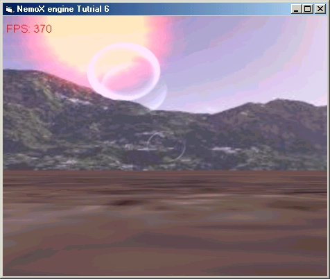



## DirectX 8 3d engine Lens Flare Effect Tutorial

### Description

This little tutorial code show how to make cool

Lenflare effect and Glow effect with NemoX engine

in VB

The code is very simple to understand and is step by step commented

All the source code is included

For any remark,question

let your Feedbacks

Fore more tutorials about how to use NemoX engine

go to the engine Website at this link

http://perso.wanadoo.fr/malakoff/index.htm
 
### More Info
 

             |
---                |---
**Submitted On**   |2002-11-12 22:38:20
**By**             |[polaris](https://github.com/Planet-Source-Code/PSCIndex/blob/master/ByAuthor/polaris.md)
**Level**          |Advanced
**User Rating**    |5.0 (10 globes from 2 users)
**Compatibility**  |VB 4\.0 \(32\-bit\), VB 5\.0, VB 6\.0
**Category**       |[DirectX](https://github.com/Planet-Source-Code/PSCIndex/blob/master/ByCategory/directx__1-44.md)
**World**          |[Visual Basic](https://github.com/Planet-Source-Code/PSCIndex/blob/master/ByWorld/visual-basic.md)
**Archive File**   |[DirectX\_8\_14966011132002\.zip](https://github.com/Planet-Source-Code/polaris-directx-8-3d-engine-lens-flare-effect-tutorial__1-40678/archive/master.zip)

